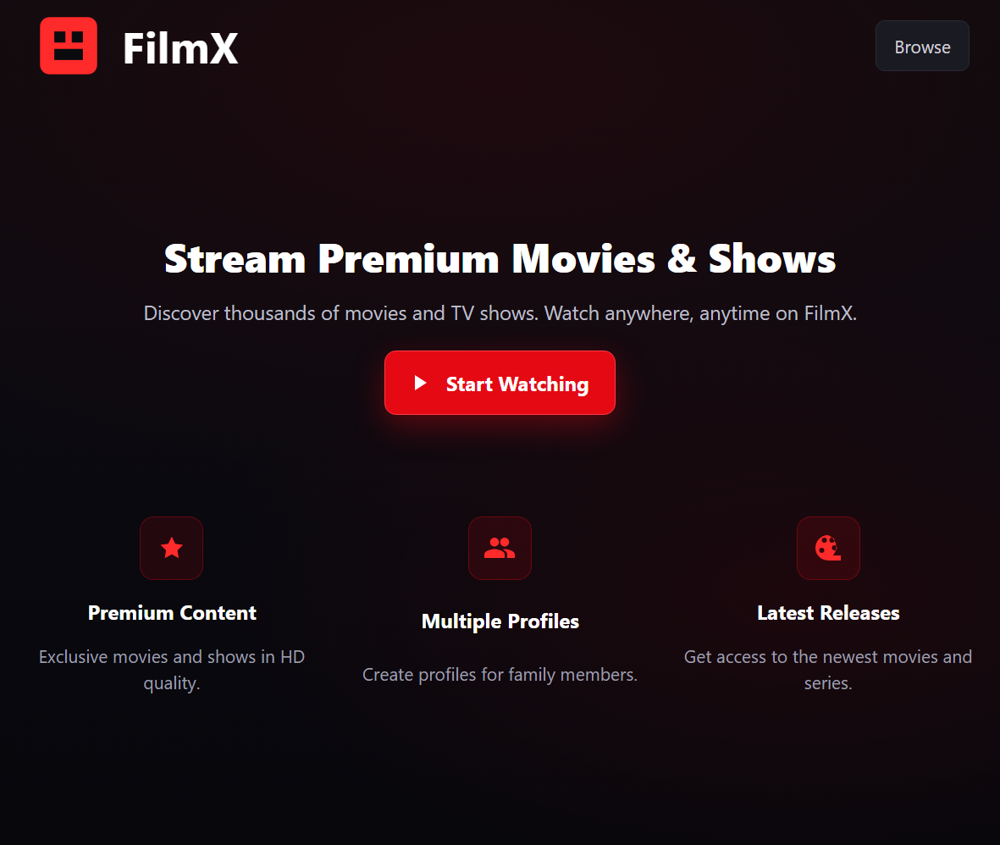
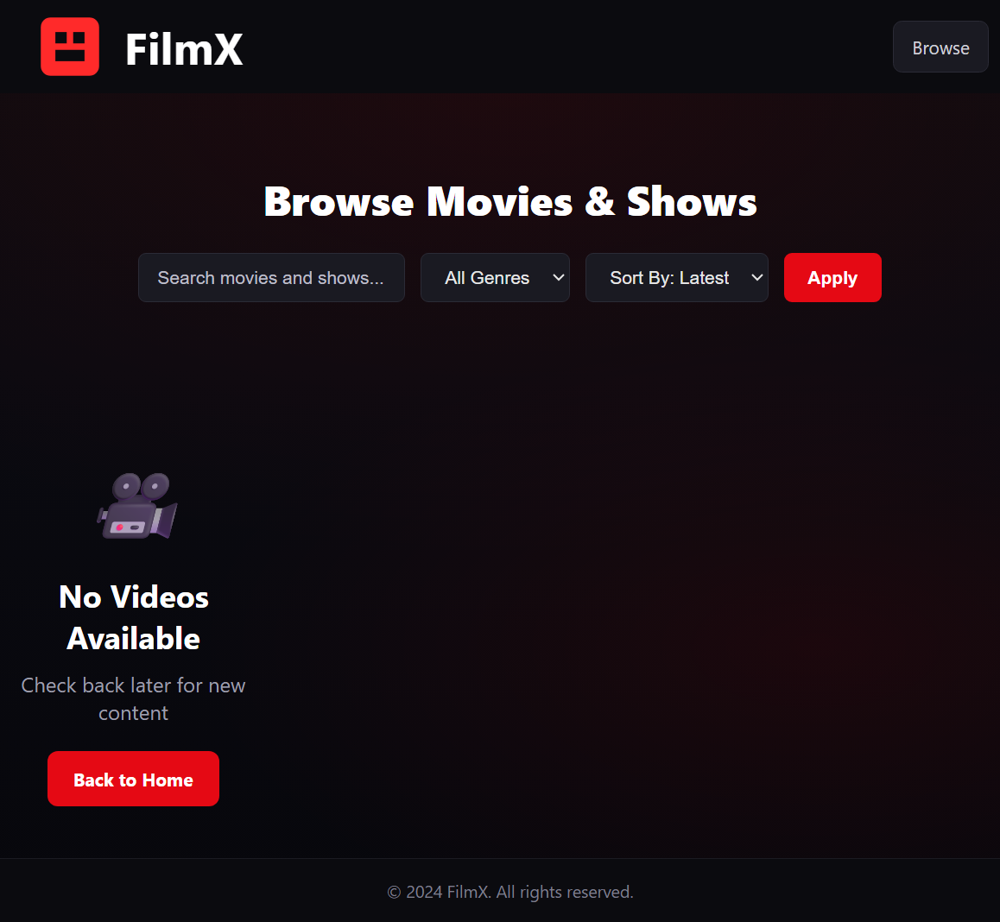
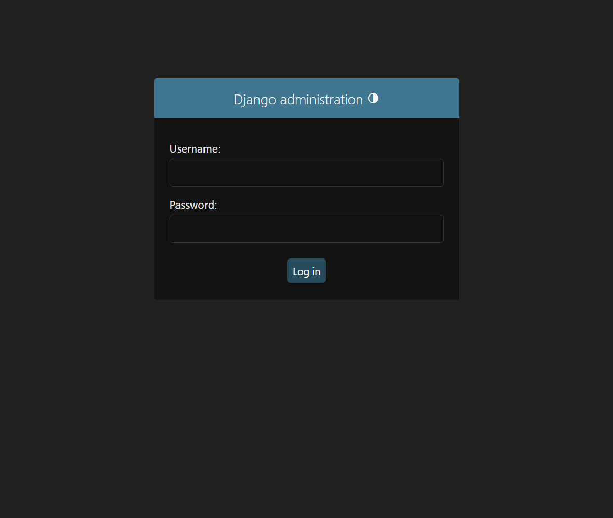
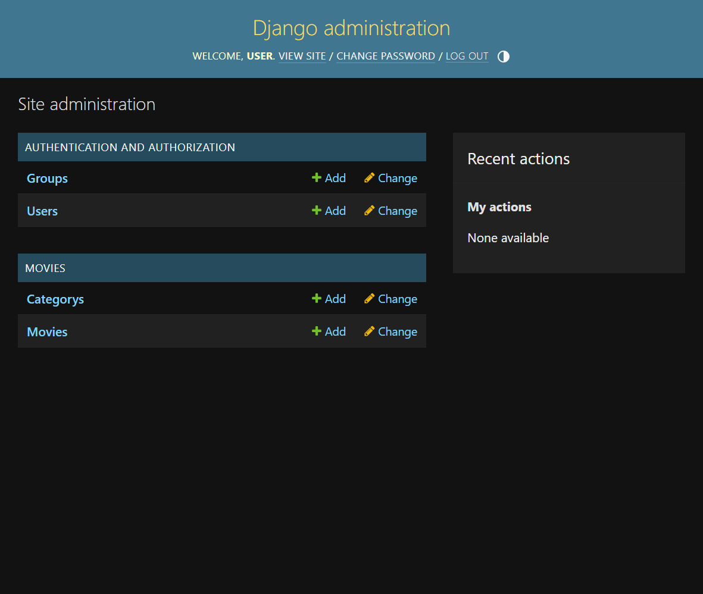
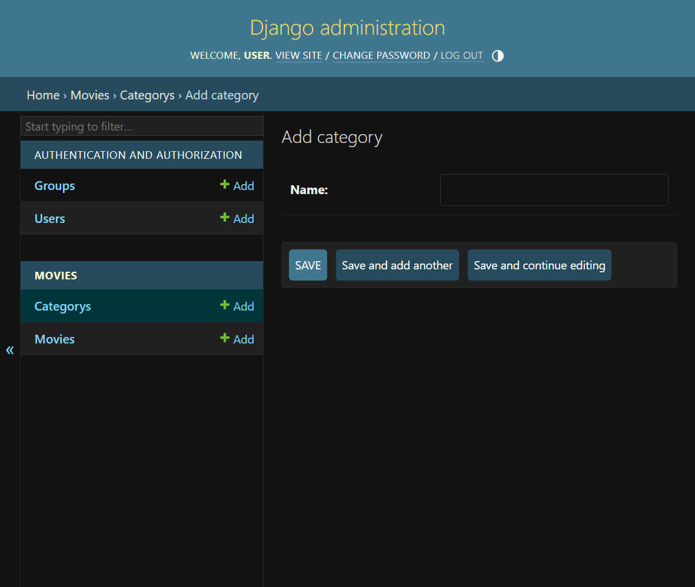
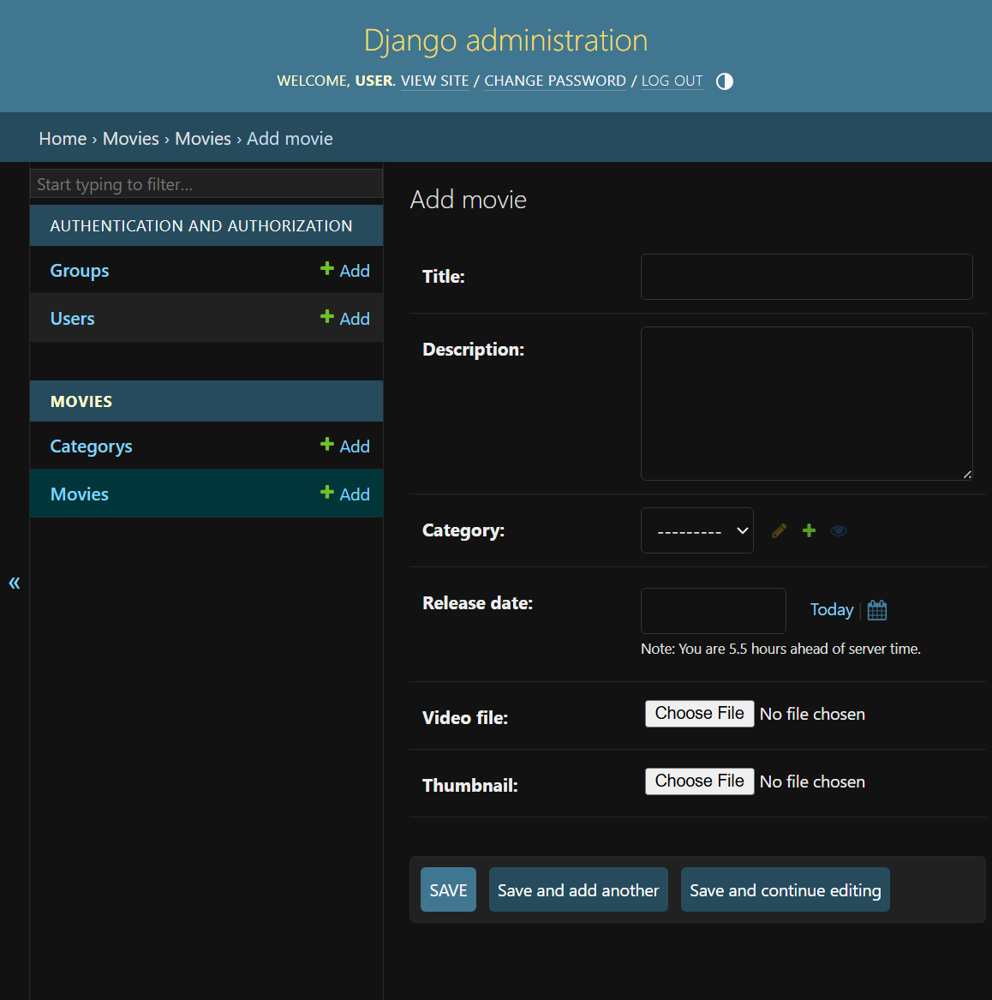

# 🎬 FilmX — Netflix-Style Movie Streaming Platform


FilmX is a full-stack movie streaming web application built using Django, HTML, CSS, and JavaScript.  
It allows administrators to upload movies and shows through the Django admin panel, while users can browse, search, and stream video content through a modern Netflix-style interface.

---

# 🌐 Overview

FilmX is designed to simulate a real-world streaming platform similar to Netflix.  
It includes content management, streaming support, filtering, and responsive UI.

This project demonstrates:

- Full-stack Django development
- Media streaming implementation
- Admin-based content management
- Modern frontend UI design
- Django project structuring

---

# 🚀 Features

## 🎬 Movie Management

- Upload movies using Django Admin
- Add movie titles and descriptions
- Upload video files
- Upload movie posters
- Manage movie content easily
- Delete or update movies

---

## 🔍 Browsing & Search

- Browse movie collection
- Search movies by title
- Filter movies
- Display movie posters
- Responsive movie grid layout

---

## ▶️ Streaming System

- Watch movies directly in browser
- Video playback support
- Media streaming via Django
- Organized media file handling

---

## 🧑‍💼 Admin Panel

Powered by Django Default Admin:

- Add movies
- Edit movies
- Delete movies
- Manage genres (if implemented)
- Manage media content

Admin URL:
```
/admin/
```

---

## 🎨 Frontend UI

Netflix-style user interface:

- Dark theme design
- Modern layout
- Movie card display
- Hover effects
- Responsive design
- Mobile-friendly layout

---
# 🎬 Demo

## 🏠 Homepage

Main landing page showing featured movies and categories.



---

## 🎞 Browse Movies Page

Users can browse all available movies.



---

## 🔐 Admin Login

Administrator login page.



---

## 🧑‍💼 Admin Dashboard

Main admin control panel.



---

## 🎭 Add Category

Admin can create movie categories.



---

## 🎬 Add Movie

Admin can upload movies with thumbnail and video.


---

# 🛠 Technology Stack

## Backend

- Django 4.x
- Python 3.x
- SQLite (default database)

---

## Frontend

- HTML5
- CSS3
- JavaScript

---

## Admin System

- Django Default Admin Panel

---

# 📂 Project Structure

```
FlimX
│   .gitignore
│   manage.py
│   readme.md
│   requirements.txt
│   
├───media
│   ├───movies
│   └───thumbnails
├───movies
│   │   admin.py
│   │   apps.py
│   │   models.py
│   │   tests.py
│   │   urls.py
│   │   views.py
│   │   __init__.py
│   │   
│   ├───migrations
│   │           
│   ├───static
│   │   └───movies
│   │       ├───css
│   │       │       style.css
│   │       │       
│   │       ├───images
│   │       └───js
│   │               script.js
│   │               
│   ├───templates
│   │   │   base.html
│   │   │   
│   │   └───movies
│   │           browse.html
│   │           index.html
│   │           watch.html
│   
│           
└───NetFlix
    │   asgi.py
    │   settings.py
    │   urls.py
    │   wsgi.py
    │   __init__.py

```


---

# ⚙️ Installation Guide

## 1️⃣ Clone Repository

```
git clone https://github.com/ranjanarnav/FilmX.git

cd FilmX
```

---

## 2️⃣ Install Dependencies

```
pip install -r requirements.txt
```

---

## 3️⃣ Apply Migrations

```
python manage.py makemigrations
python manage.py migrate
```

---

## 4️⃣ Create Admin User

```
python manage.py createsuperuser
```

Enter:

- Username
- Email
- Password

---

## 5️⃣ Run Development Server

```
python manage.py runserver
```


Open:

```
http://127.0.0.1:8000/
```

---

## 6️⃣ Access Admin Panel

```
http://127.0.0.1:8000/admin/
```


Login using superuser credentials.

---

# 📁 Media Handling

Uploaded files such as:

- Movie videos
- Movie posters

Are stored inside:

```
media/
```


---

# 🧠 Learning Objectives

This project demonstrates:

- Django full-stack development
- Media file handling
- Template rendering
- Static file management
- Admin content management
- Streaming interface design

---

# 🔮 Future Improvements

Planned features:

- User authentication system
- Watch history tracking
- Movie recommendations
- Favorites list
- Subscription system
- Cloud media storage
- Video compression support

---

# 👨‍💻 Author

**Arnav Ranjan**

Full Stack Developer  
Focused on Django-based web applications and UI-driven platforms.

---

# 📜 License

This project is for educational and development purposes.